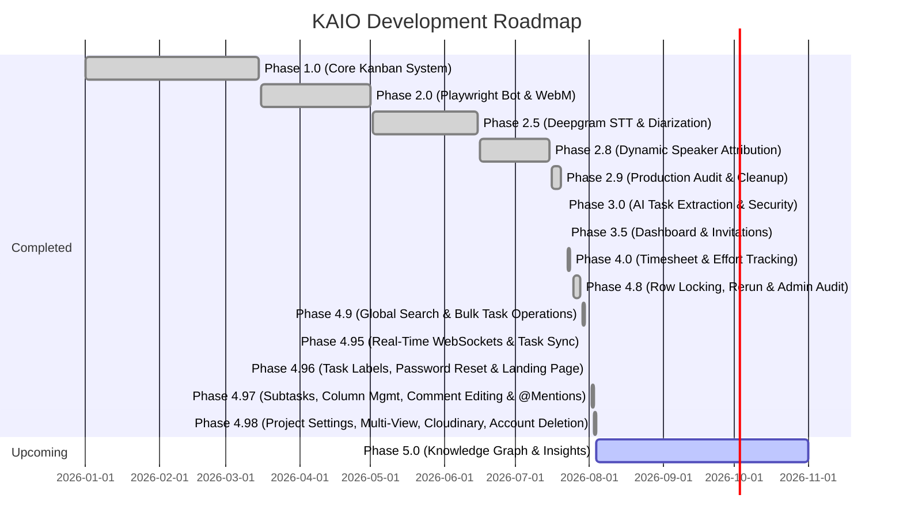

# 01 — Project Overview

## 1. Executive Summary & Vision

**KAIO** (Kanban AI Orchestration) is an enterprise-grade, AI-native meeting intelligence and task orchestration platform. It automatically converts live video meetings into structured, actionable task boards with real-time speaker attribution, transcript resolution, and automated task extraction.

```
┌─────────────────┐       ┌─────────────────┐       ┌─────────────────┐       ┌─────────────────┐
│   Google Meet   │  ───► │  Playwright Bot │  ───► │ Deepgram Engine │  ───► │ Task Board UI   │
│ Live Meeting    │       │ Audio & Presence│       │ STT + Diarize   │       │ Speaker Aligned │
└─────────────────┘       └─────────────────┘       └─────────────────┘       └─────────────────┘
```

---

## 2. Core Value Proposition & Unique Selling Proposition (USP)

Unlike traditional meeting recording tools that generate static videos or raw transcripts without owner attribution, KAIO provides:

1. **Zero-Touch Automated Joining & Capture**: Playwright bot joins scheduled Google Meet links, streaming tab audio directly into non-lossy WebM buffers while concurrently observing participant presence.
2. **Real-time Chrome Extension Integration**: Manifest V3 extension tracks participant arrivals, departures, mute toggles, and display name changes, giving the backend a deterministic timeline of present attendees.
3. **Atomic Speech & Diarization**: Leverages Deepgram Nova-3 API for simultaneous, multi-speaker word-level transcription and timestamped speaker diarization.
4. **Dynamic Speaker Attribution**: Merges presence timelines with audio timestamps using a weighted score heuristic (Presence overlapping, turn affinity, roster confidence) to produce `participant_attributed_transcript.json`.
5. **Strict Database Architecture**: PostgreSQL database powered entirely by canonical views (`v_*_canonical`) and stored procedures, guaranteeing zero raw SQL query leaks in backend code.
6. **Manager/Superadmin Dashboard**: Aggregated org-wide KPI metrics, per-board progress summaries, and recent activity feed gated behind RBAC.
7. **Invitation Lifecycle Management**: Full workspace invitation system — send, list, verify, accept, and revoke pending invitations.
8. **Enterprise Timesheet Management**: Comprehensive weekly effort logging against boards/tasks, customizable organization policies, manager approval queues, row-level locking, audit trails, and reporting views.
9. **Resilient Meeting Pipeline & Admin Operations**: Session rerun pipeline for recovered execution, system health status monitoring, and CSV audit log exports.
10. **Global Search, Bulk Operations & Transcript Intelligence**: Cmd+K workspace-wide search across tasks, boards, and meetings, multi-select task card bulk operations, and post-meeting interactive transcript editing.
11. **Real-Time WebSocket Updates & Task Deep Linking**: Low-latency WebSocket event channel broadcasting live task movements and unread notification alerts with sidebar status monitoring, combined with bidirectional task modal URL deep linking.
12. **Board & Task Labels / Color-Coded Tagging System**: Board-scoped customizable label taxonomy (`057`-`059`), multi-label task tagging, real-time label event broadcasting, and instant board filter pills.
13. **Account Security, Password Reset & Email Verification**: Secure password reset flow via cryptographic single-use tokens, email verification workflow (`055`), background email task sender (Brevo / SMTP), and security audit log integration. Including a secure **Danger Zone** for account hard deletion.
14. **Public Marketing Landing Page**: Bespoke React 19 + Tailwind v4 marketing landing page showcasing live transcript-to-task pipeline visuals and interactive platform highlights.
15. **Rich Text & Multi-View Boards**: TipTap Markdown editor integration for rich text descriptions and comments. Dynamic visualization via Kanban, List, and Calendar view modes.
16. **Cloudinary Asset Management**: Native Cloudinary integration for scalable task attachment storage with metadata tracking.
17. **Project & Workflow Settings**: Dedicated administrative layouts for precise board label, member, and workflow lifecycle management.

---

## 3. High-Level Architecture Diagram

```mermaid
graph TD
    subgraph Client Layer
        FE[React 19 SPA / Vite]
        EXT[Chrome Extension MV3]
        LAND[Public Landing Page]
    end

    subgraph API Gateway & Core Backend
        API[FastAPI Gateway /api/v1]
        AUTH[Auth Service / httpOnly Cookie JWT & Reset]
        BOARD[Board & Task Service]
        LABEL[Labels Service]
        DASH[Dashboard Service]
        INV[Invitation Service]
        TS[Timesheet Engine & Approval Queue]
        SEARCH[Global Search Service]
    end

    subgraph Meeting Subsystem
        MS[Meeting Service / Manager]
        BOT[Playwright Bot Controller]
        REC[MediaRecorder Script]
        PIPE[Meeting Pipeline Orchestrator]
        TRANS[Transcript Editor]
    end

    subgraph AI & External Services
        DG[Deepgram Nova-3 API]
        LLM[Puter / Gemini Provider]
        KAI[KAI Board Assistant Agent]
    end

    subgraph Data Store
        DB[(PostgreSQL Database)]
        STORAGE[(Local Disk File Storage)]
    end

    FE <──► API
    LAND ──► FE
    EXT ──►|Presence Events| API
    API ──► AUTH
    API ──► BOARD
    API ──► LABEL
    API ──► MS
    API ──► DASH
    API ──► INV
    API ──► TS
    API ──► SEARCH
    API ──► KAI
    MS ──► BOT
    BOT ──► REC
    REC ──►|WebM Output| STORAGE
    MS ──► PIPE
    PIPE ──► STORAGE
    PIPE ──► DG
    PIPE ──► LLM
    BOARD ──►|Canonical Views & Stored Procs| DB
    LABEL ──►|v_labels_canonical & fn_label_*| DB
    AUTH ──►|Stored Procedures| DB
    DASH ──►|Canonical Views| DB
    TS ──►|Timesheet Canonical Views & Procs| DB
    SEARCH ──►|v_global_search_canonical| DB
```

---

## 4. Major Sub-systems Overview

### 4.1 Backend Engine (`backend/app`)
- Built with **Python 3.12+** and **FastAPI**.
- Uses `asyncpg` connection pooling for non-blocking database operations.
- **27 REST API & WebSocket routers** covering auth (including password reset & email verification), boards, tasks, labels, comments, subtasks, attachments, notifications, activity, board members, admin, invitations, my-work, preferences, organization, AI, task proposals, dashboard, users, timesheets, timesheet approvals, timesheet admin, search, columns, websockets (`/ws`), and the meeting subsystem.
- In-memory WebSocket manager (`ConnectionManager`) supporting topic/board subscriptions and targeted user notification broadcasting.
- Enforces a strict architectural constraint: **NO raw SQL in backend Python services**. All reads use `v_*_canonical` views, and writes call PostgreSQL stored functions.
- Authentication uses **httpOnly cookie-based JWT** — `access_token` (15 min) and `refresh_token` (7 days) set as server-side cookies; no tokens are exposed in response bodies.

### 4.2 Meeting Pipeline (`backend/app/meeting`)
- Post-processing orchestrator managing stage-based pipeline execution.
- Managed by `MeetingService` and `SessionManager`.
- Bot automation using Playwright Chromium with non-interactive headless profiles.
- Includes manual transcript editor and speaker attribution override support.

### 4.3 Database Engine (`database/`)
- Pure PostgreSQL schema managed via **65 SQL migration files** (`001_*.sql` → `065_comment_mentions.sql`).
- Custom functions for authorization, mutations, triggers, security events, user session management, task proposal approval queues, dashboard KPI views, invitation lifecycle, timesheet grid & approvals, row locking, meeting failure/rerun handling, global search indexing, bulk task move, atomic task deletion with notification cleanup (`fn_delete_task`), target reference formatting with task titles, labels management (`fn_create_label`, `fn_delete_label`, `fn_attach_label`, `fn_detach_label`), subtasks checklist management (`fn_create_subtask`, `fn_toggle_subtask`, `fn_delete_subtask`, `fn_reorder_subtasks`), column management (`fn_add_column`, `fn_rename_column`, `fn_delete_column`, `fn_reorder_columns`), comment editing & mentions (`fn_update_comment`, `fn_create_comment_mentions`), password reset & email verification, and canonical views (`v_labels_canonical`, `v_subtasks_canonical`, `v_comment_mentions_canonical`).
- Rebuild script: `database/scripts/rebuild.py` — supports incremental apply (`python rebuild.py`) or full reset (`python rebuild.py --reset`).

### 4.4 Frontend SPA (`frontend/`)
- Built with **React 19**, **TypeScript**, **Vite**, and **Tailwind CSS v4**.
- State managed via **Zustand** stores (10 stores + WebSocket `wsConnected` state: `authStore`, `boardStore`, `taskStore`, `adminStore`, `notificationStore`, `organizationStore`, `preferencesStore`, `projectSettingsStore`, `activityStore`, `uiStore`).
- **15 Feature Modules** (`activity`, `admin`, `ai`, `auth`, `boards`, `dashboard`, `landing`, `meeting`, `my-work`, `notifications`, `projects`, `proposals`, `search`, `settings`, `timesheets`).
- **25 API Service files** (`activityApi.ts`, `adminApi.ts`, `attachmentsApi.ts`, `authApi.ts`, `boardsApi.ts`, `columnsApi.ts`, `commentsApi.ts`, `dashboardApi.ts`, `invitationsApi.ts`, `labelsApi.ts`, `meetingApi.ts`, `myWorkApi.ts`, `notificationsApi.ts`, `organizationApi.ts`, `preferencesApi.ts`, `projectSettingsApi.ts`, `searchApi.ts`, `subtasksApi.ts`, `taskProposals.ts`, `tasksApi.ts`, `timesheetAdminService.ts`, `timesheetApprovalService.ts`, `timesheetReportsApi.ts`, `timesheetService.ts`, `usersApi.ts`).
- Custom `useWebSocket` hook maintaining connection heartbeat, auto-reconnect, sidebar connection status dot, and board-level event subscriptions.
- Drag-and-drop powered by **@dnd-kit** (core + sortable) with optimistic rollbacks.
- Route guards: `ProtectedRoute` (auth check) and `RequireRole` (RBAC role check).
- Interactive notifications with destination deep-linking, bidirectional task modal URL state sync (`?taskId=...`), color-coded task label picker & filter pills, multi-device session management UI, task proposal review queues, weekly timesheet effort logging grid with row locking controls, global search Cmd+K modal dialog, multi-select task move toolbar, transcript manual editor, public landing page, and admin system status/audit export tools.
- **TipTap Markdown Editor & Multi-Views**: Rich text support via TipTap, providing seamless markdown editing. Task boards support seamless switching between Kanban, List, and Calendar views.
- **Comprehensive Settings Architecture**: Split settings layout for Account Profile (including Danger Zone) and Project Settings (Labels, Members, and Workflow).

### 4.5 Chrome Extension (`extension/`)
- Manifest V3 extension monitoring Google Meet DOM changes.
- Sends presence events (`ParticipantJoined`, `ParticipantLeft`, `ParticipantRenamed`, `HostTransferred`) to the backend `/presence` endpoint.

---

## 5. Current Implementation Status & Roadmap



| Phase | Name | Description | Status |
|---|---|---|---|
| **1.0** | Core Kanban Board | Users, Workspaces, Boards, Tasks, Comments, Auth | **Completed** |
| **2.0** | Bot & Audio Capture | Google Meet automation via Playwright + MediaRecorder | **Completed** |
| **2.5** | Deepgram Integration | Cloud Speech-to-Text & atomic Speaker Diarization | **Completed** |
| **2.8** | Speaker Attribution | Alignment of participant timelines & diarized turns | **Completed** |
| **2.9** | Audit & Stabilization | Code cleanup, dead provider deletion, performance tuning | **Completed** |
| **3.0** | AI Task Extraction & Security | Automated LLM action items, proposal review queue, multi-device sessions & security event logs | **Completed** |
| **3.5** | Dashboard & Invitations | Manager/Superadmin KPI dashboard, per-board summaries, invitation revocation, cookie-based auth | **Completed** |
| **4.0** | Enterprise Timesheet System | Weekly grid effort tracking, org policy config, manager approval queue, task assignment enforcement, reporting views | **Completed** |
| **4.8** | Row Locking & Admin Audit | Timesheet row locking, meeting rerun pipeline, system health monitoring, and audit log exports | **Completed** |
| **4.9** | Global Search & Bulk Tasks | Cmd+K global search, multi-select task move & multi-task deletion, and transcript editor | **Completed** |
| **4.95** | Real-Time WebSockets & Task Sync | WebSockets live event stream, sidebar connection status indicator, and task modal URL deep linking | **Completed** |
| **4.96** | Task Labels, Security & Landing Page | Board-scoped customizable task labels/tags, password reset & email verification, and landing page redesign | **Completed** |
| **4.97** | Subtasks, Column Mgmt & Comment Features | Task subtask checklists (drag-to-reorder, progress bar), dynamic Kanban column management (add/rename/delete/reorder), inline comment editing with `(edited)` label, and @mention autocomplete with `MENTIONED_IN_COMMENT` notifications | **Completed** |
| **4.98** | Project Settings & Core Enhancements | TipTap markdown editor, Cloudinary file attachments, Board Multi-views (Calendar & List), Account Hard Deletion (Danger Zone), Project Settings modules, and Brevo email integration. | **Completed** |
| **5.0** | Knowledge Graph & Insights | Cross-board relationships, smart meeting analytics & insights | **In Progress** |
