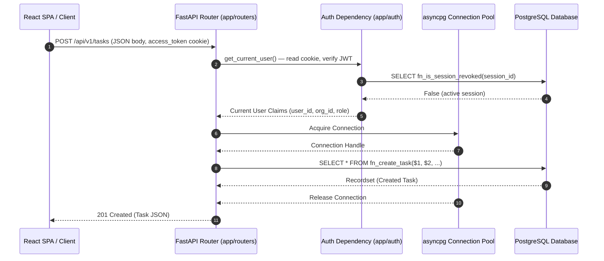

# 02 — Backend Architecture

## 1. Executive Summary & Technology Stack

The KAIO backend is built using modern asynchronous Python architecture centered around **FastAPI** and **asyncpg**.

```
┌─────────────────────────────────────────────────────────────────┐
│                       FastAPI Application                       │
├─────────────────────────────────────────────────────────────────┤
│  Routers (API Layer) ──► Services Layer ──► DB Stored Procs     │
├─────────────────────────────────────────────────────────────────┤
│                     asyncpg Connection Pool                     │
└─────────────────────────────────────────────────────────────────┘
                                 │
                                 ▼
                   ┌───────────────────────────┐
                   │ PostgreSQL 15+ Database   │
                   └───────────────────────────┘
```

### Core Technologies:
- **Framework**: FastAPI (v0.110+)
- **ASGI Server**: Uvicorn (v0.28+)
- **Database Driver**: `asyncpg` (v0.29+)
- **Auth**: PyJWT (pyjwt[crypto]) + bcrypt + Passlib — delivered via **httpOnly cookies**
- **Data Validation**: Pydantic v2 + Pydantic Settings
- **Browser Automation**: Playwright Python (v1.40+)
- **Audio Processing**: FFmpeg binary integration
- **Speech Engine**: Deepgram SDK (v3.0+)
- **HTTP Client**: httpx (v0.27+) — used by LLM providers and Brevo API
- **Email**: Brevo REST API (v3) primary delivery, with fallback to standard SMTP (`BREVO_API_KEY`, `SMTP_EMAIL`, `SMTP_PASSWORD` env vars)

---

## 2. Architectural Rules & Constraints

> [!CAUTION]
> ### Mandatory Architectural Rule: NO Inline Raw SQL
> Under **NO circumstance** may Python routers or service classes execute raw SQL statements (`SELECT`, `INSERT`, `UPDATE`, `DELETE`).
> - **Read Operations**: Must select directly from canonical views (`v_*_canonical`).
> - **Write Operations**: Must call PostgreSQL user-defined functions or stored procedures (e.g., `SELECT fn_create_task(...)`).
> - **Violation Prevention**: Code reviews must fail if inline SQL query strings are found in application code.

---

## 3. Module Hierarchy & Directory Structure

```
backend/
├── .env                            # Environment configuration (DATABASE_URL, JWT_SECRET, etc.)
├── requirements.txt                # Python dependencies
├── app/
│   ├── main.py                     # Entry point, FastAPI app, CORS, static mounts, lifespan hooks
│   ├── ai/                         # LLM integration (OpenAI/Puter/Gemini providers, KAI agent, clarification router, gateway)
│   ├── auth/                       # JWT verification, password hashing, session tracking, RBAC
│   │   ├── dependencies.py         # get_current_user, require_proposal_review_access, require_meeting_initiation_access
│   │   ├── jwt.py                  # create_access_token, verify_token
│   │   ├── password.py             # bcrypt hash & verify helpers
│   │   └── permissions.py          # require_super_admin, require_manager_or_above
│   ├── config/
│   │   └── settings.py             # pydantic-settings: DATABASE_URL, JWT_SECRET, JWT_ALGORITHM, BREVO_*, SMTP_*, CLOUDINARY_*, FRONTEND_ORIGINS
│   ├── constants/                  # System constants & enums
│   ├── database/
│   │   └── connection.py           # asyncpg pool manager, get_db_connection dependency
│   ├── meeting/                    # Meeting pipeline subsystem (bot, recorder, orchestrator, attribution)
│   ├── websockets/                 # WebSocket subsystem:
│   │   ├── auth.py                 # WebSocket connection JWT query parameter authentication
│   │   ├── manager.py              # In-memory ConnectionManager (user connections, board room subscriptions, broadcasts)
│   │   └── router.py               # /ws endpoint handler, message routing (ping/subscribe_board/unsubscribe_board)
│   ├── routers/                    # 26 REST API & WebSocket endpoint modules:
│   │   ├── activity.py             # GET /activity — audit log history
│   │   ├── admin.py                # /admin — user/board CRUD, system health status, audit log export (Superadmin-gated)
│   │   ├── ai.py                   # /ai — KAI AI agent endpoints
│   │   ├── attachments.py          # /tasks/{id}/attachments — file uploads (Cloudinary/Local) & downloads
│   │   ├── auth.py                 # /auth — login, register org, me, refresh, logout, password reset, email verification, sessions, security events, account hard deletion (danger zone)
│   │   ├── board_members.py        # /boards/{id}/members — membership queries & project settings
│   │   ├── boards.py               # /boards — CRUD, archiving
│   │   ├── columns.py              # /boards/{id}/columns, /columns/{id} — dynamic column management (add, rename, delete with card migration, reorder)
│   │   ├── comments.py             # /tasks/{id}/comments — create, update (inline edit), list, delete
│   │   ├── dashboard.py            # /dashboard/summary — Manager/Superadmin KPI dashboard
│   │   ├── invitations.py          # /invitations — invite, list, verify, accept, revoke
│   │   ├── labels.py               # /boards/{id}/labels, /labels/{id}, /tasks/{id}/labels — board label management & task tagging (WS broadcast)
│   │   ├── my_work.py              # /my-work — user task aggregation & summary
│   │   ├── notifications.py        # /notifications — list, mark read, mark all read
│   │   ├── organization.py         # /organization — org profile & settings
│   │   ├── preferences.py          # /preferences — user UI & notification preferences
│   │   ├── search.py               # /search — workspace-wide full-text search across tasks, boards, and meetings
│   │   ├── subtasks.py             # /tasks/{id}/subtasks — subtask checklist CRUD, toggle completion, reorder
│   │   ├── task_proposals.py       # /proposals — AI proposal review, approve, reject
│   │   ├── tasks.py                # /tasks — CRUD, move, reorder, bulk-move, bulk-delete (broadcasts WS events on mutations)
│   │   ├── timesheets.py           # /timesheets — draft grid, entry upsert/delete, submit, recall
│   │   ├── timesheet_approvals.py  # /timesheets/approvals — manager approval queue, approve, reject
│   │   ├── timesheet_admin.py      # /timesheets/policy, /timesheets/approvers, row locking, export
│   │   ├── timesheet_errors.py     # Centralized stored procedure error code mapper (including TASK_ASSIGNMENT_CHANGED)
│   │   ├── users.py                # /users — user directory & profile queries
│   │   └── (meeting router)        # /meeting — mounted from app/meeting/api/router.py (join, leave, status, transcript, rerun)
│   ├── schemas/                    # 25 Pydantic v2 request/response DTO schema files (including label.py, subtask.py, column.py, attachments.py, envelope.py)
│   └── services/                   # Business logic services:
│       ├── activity_service.py
│       ├── admin_service.py
│       ├── attachment_service.py
│       ├── auth_service.py         # Registration, login, password reset token creation & verification, email verification tokens
│       ├── board_service.py
│       ├── column_service.py       # Column management: add, rename, delete (with task migration), reorder
│       ├── comment_service.py      # Comment create, update (inline edit via fn_update_comment), delete, @mention dispatch
│       ├── dashboard_service.py    # Reads v_dashboard_kpis_canonical, v_dashboard_board_summaries_canonical
│       ├── email_service.py        # Async background email dispatch wrapper (Brevo API + SMTP fallback)
│       ├── email_templates.py      # HTML email templates for invitations, password reset & email verification
│       ├── invitation_service.py   # Full invitation lifecycle (invite → email → verify token → accept → revoke)
│       ├── my_work_service.py
│       ├── notification_service.py # Dispatches real-time WS notification alerts to connected target users
│       ├── organization_service.py
│       ├── organization_deletion_service.py # Handles organization soft-delete lifecycle and cleanup
│       ├── organization_purge_worker.py     # Background worker that permanently purges scheduled org deletions
│       ├── preferences_service.py
│       ├── project_settings.py     # Board project settings (icon, color, key, etc.)
│       ├── storage_service.py      # Dual-mode file storage: Cloudinary integration (primary) & Local disk (fallback)
│       ├── task_reminder_worker.py # Background worker that dispatches in-app notifications for due tasks
│       ├── task_service.py         # Handles CRUD, reordering, bulk task move, and bulk task deletion via fn_bulk_move_tasks & fn_bulk_delete_tasks
│       └── user_service.py

└── tests/                          # Pytest automated test suites
```

---

## 4. Key Subsystem Breakdown

### 4.1 FastAPI Application Lifespan (`app/main.py`)
Manages startup and shutdown hooks using `asynccontextmanager`:
- **Startup**: Initializes `asyncpg` connection pool via `db.connect()`. Mounts `uploads/` directory as static files at `/uploads`.
- **Shutdown**: Safely cancels active meeting runtimes via `meeting_service.shutdown_all()`, then closes DB connections via `db.disconnect()`.

### 4.2 Database Connection Manager (`app/database/connection.py`)
- Maintains a global `Database` instance holding an `asyncpg.Pool`.
- Configures custom type codecs for JSON and JSONB fields using standard Python `json.dumps`/`json.loads`.
- Provides dependency `get_db_connection()` yielding non-blocking connections from pool.

### 4.3 Auth & Security Subsystem (`app/auth/`, `app/routers/auth.py`)

> [!IMPORTANT]
> **Auth uses httpOnly cookies, NOT Authorization headers.**
> - `POST /auth/login` → sets `access_token` cookie (15 min, httpOnly) + `refresh_token` cookie (7 days, httpOnly, path=`/api/v1/auth`)
> - `GET /auth/me` + all protected endpoints → reads `access_token` cookie (or fallback to `Authorization: Bearer` header)
> - `POST /auth/refresh` → reads `refresh_token` cookie, issues new cookies
> - `POST /auth/logout` → clears both cookies, optionally revokes session
> - `DELETE /auth/sessions/other` → revokes all non-current sessions

**RBAC Layers:**
- `get_current_user` — verifies JWT from cookie, checks `fn_is_session_revoked()` in DB
- `require_proposal_review_access` — calls `fn_check_proposal_review_access(user_id, org_id)` (Superadmin/Manager)
- `require_meeting_initiation_access` — calls `fn_check_meeting_initiation_access(user_id, org_id)` (Superadmin/Manager)
- `require_manager_or_above` — role string check (`MANAGER` or `SUPER_ADMIN`)
- `require_super_admin` — role string check (`SUPER_ADMIN` only)

**Session & Security features:**
- Multi-device JWT session tracking in `active_sessions` table (`fn_refresh_session`, `fn_is_session_revoked`)
- Security event logging (`fn_log_security_event`) tracking logins, password updates, session revocations, and role changes with IP and User-Agent metadata
- Configurable organization password policy endpoint (`GET /auth/password-policy`)

### 4.4 Meeting Subsystem & Transcript Editor (`app/meeting/`)
The meeting subsystem is self-contained and modular:
- `api/router.py`: Exposes endpoints for managing meeting sessions, fetching transcripts, and applying manual transcript text/speaker overrides (`PUT /meeting/sessions/{id}/transcript`).
- `bot/recorder/recorder.py`: `MeetingRecorder` manages PulseAudio audio capture via an FFmpeg subprocess and WebM stream assembly.
- `pipeline/orchestrator.py`: `MeetingPipelineOrchestrator` controls sequential execution of meeting stages.
- `services/meeting_service.py`: `MeetingService` maintains active runtime instances (`MeetingRuntime`) and background tasks.

### 4.5 Dashboard & Search Services (`app/services/dashboard_service.py`, `app/routers/search.py`)
- **Dashboard Service**: Reads `v_dashboard_kpis_canonical`, `v_dashboard_board_summaries_canonical`, and `v_activities_canonical` in a single request cycle.
- **Global Search Router**: Queries `v_global_search_canonical` using PostgreSQL full-text search (`plainto_tsquery('english', q)`) and pattern ILIKE matching to return indexed tasks, boards, and meetings filtered by organization scope.

### 4.6 WebSocket Infrastructure & Real-Time Events (`app/websockets/`)
- `ConnectionManager` (`app/websockets/manager.py`): In-memory connection state registry mapping authenticated `user_id`s to active WebSocket sockets and topic subscriptions (`subscribe_board`, `unsubscribe_board`).
- **WebSocket Auth** (`app/websockets/auth.py`): Validates incoming WebSocket handshake requests using query parameter `token` (`GET /ws?token=...`), checking JWT validity and DB session revocation status (`fn_is_session_revoked`).
- **Board Event Broadcaster**: `tasks.py` router triggers `manager.broadcast_to_board(board_id, event_payload)` on task creation, update, move, or deletion to propagate changes to all viewing clients.
- **Notification Direct Messaging**: `notification_service.py` dispatches `manager.send_personal_message(user_id, notification_payload)` for instant unread alerts.

---

## 5. End-to-End Request Execution Flow



---

## 6. Major Classes & Interfaces Catalog

| Class / Interface | Path | Category | Responsibility |
|---|---|---|---|
| `FastAPI` | `app/main.py` | Framework | Top-level ASGI web application controller |
| `Database` | `app/database/connection.py` | Infrastructure | `asyncpg` pool lifecycle manager |
| `Settings` | `app/config/settings.py` | Config | pydantic-settings env config (`DATABASE_URL`, `JWT_SECRET`, `BREVO_*`, `CLOUDINARY_*`, `FRONTEND_ORIGINS`) |
| `ConnectionManager` | `app/websockets/manager.py` | WebSocket Engine | Maintains user connections, board topic subscriptions, and real-time event broadcasting |
| `MeetingService` | `app/meeting/services/meeting_service.py` | Service | Global registry and manager of active meeting runtimes |
| `MeetingRuntime` | `app/meeting/services/meeting_service.py` | Domain | Container for session state, Playwright browser, event bus |
| `MeetingRecorder` | `app/meeting/bot/recorder/recorder.py` | Bot Engine | PulseAudio audio capture & WebM recording assembly via FFmpeg |
| `MeetingPipelineOrchestrator` | `app/meeting/pipeline/orchestrator.py` | Orchestration | Sequential stage execution engine for post-processing |
| `PipelineContext` | `app/meeting/pipeline/context.py` | Domain Context | State context passed between pipeline stages containing artifacts |
| `DeepgramSpeechProvider` | `app/meeting/providers/speech/deepgram_provider.py` | Provider | Deepgram Nova-3 API client for STT and atomic diarization |
| `DynamicAttributionEngine` | `app/meeting/attribution/dynamic_engine.py` | Analytics Engine | Scores and aligns participant presence with speech turns |
| `NotificationService` | `app/services/notification_service.py` | Service | Generates system notifications for user assignments, comments, & proposals with real-time WS dispatch |
| `DashboardService` | `app/services/dashboard_service.py` | Service | Aggregates org KPIs, board summaries, and recent activity for Manager dashboard |
| `InvitationService` | `app/services/invitation_service.py` | Service | Full invitation lifecycle: invite → email → verify token → accept → revoke |
| `TaskProposalsRouter` | `app/routers/task_proposals.py` | API Router | Manages AI proposal queues, edits, approvals (`fn_approve_task_proposal`), and rejections |
| `AuthService` | `app/services/auth_service.py` | Service | Login, registration, token refresh, session management, security events |
| `CommentService` | `app/services/comment_service.py` | Service | Comment create, inline edit (`fn_update_comment`), delete, and @mention dispatch (`fn_create_comment_mentions`) |
| `ColumnService` | `app/services/column_service.py` | Service | Dynamic column management: add, rename, delete with task migration (`fn_delete_column`), and reorder |
| `TaskReminderWorker` | `app/services/task_reminder_worker.py` | Background Worker | Polling worker running in app lifespan that dispatches in-app notifications for due tasks using `fn_get_due_reminders`. |
