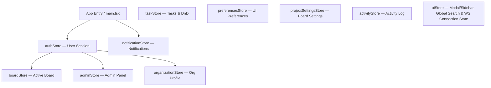
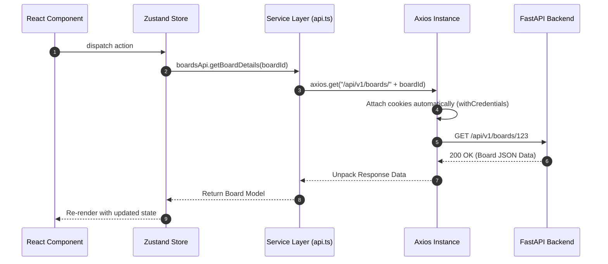

# 03 — Frontend Architecture

## 1. Executive Summary & Tech Stack

The KAIO frontend is a high-performance single-page application (SPA) built using **React 19**, **TypeScript**, and **Vite**.

```
┌─────────────────────────────────────────────────────────────┐
│                         React 19 SPA                        │
├─────────────────────────────────────────────────────────────┤
│   UI Pages & Components ──► Zustand Stores ──► API Services │
├─────────────────────────────────────────────────────────────┤
│                   Axios API Service Client                  │
└─────────────────────────────────────────────────────────────┘
                               │
                               ▼
                    ┌─────────────────────┐
                    │ FastAPI Backend API │
                    └─────────────────────┘
```

### Core Technologies:
- **Framework**: React 19 with TypeScript
- **Build Tool**: Vite v8
- **Styling**: Tailwind CSS v4 (via `@tailwindcss/vite` Vite plugin)
- **State Management**: Zustand v5 (10 stores — no Redux, no React Context for global state)
- **Routing**: React Router DOM v7
- **HTTP Client**: Axios v1 (with httpOnly cookie auth — no manual token attachment)
- **Drag & Drop**: @dnd-kit/core + @dnd-kit/sortable
- **Icons**: Lucide React
- **Toast Notifications**: react-hot-toast
- **Markdown Rendering**: react-markdown + remark-gfm
- **Date Utilities**: date-fns

---

## 2. Directory Structure

```
frontend/src/
├── app/                        # Application root (Router, app entry wiring)
├── assets/                     # Static graphics, SVG icons, logos
├── components/                 # Shared UI primitives across all features
│   ├── common/                 # Reusable modal, dialogs, avatars, project cards
│   │   ├── ConfirmDialog.tsx   # Generic confirmation dialog
│   │   ├── EmptyState.tsx      # Empty state placeholder
│   │   ├── Modal.tsx           # Accessible backdrop modal
│   │   ├── ProjectCard.tsx     # Board/project card preview
│   │   ├── ProjectIdentity.tsx # Board icon + color identity display
│   │   ├── UserAvatar.tsx      # User profile avatar with initials fallback
│   │   ├── WorkspaceLoader.tsx # Full-page loading spinner
│   │   └── WorkspaceLogo.tsx   # Organization logo/branding display
│   ├── layout/                 # Application-level layout shells
│   │   ├── AppLayout.tsx       # Main app shell (sidebar + content area)
│   │   ├── ApplicationSidebar.tsx # Left navigation sidebar
│   │   ├── SettingsLayout.tsx  # Settings page tab layout wrapper
│   │   └── UserAvatarDropdown.tsx # Header avatar menu with logout/settings
│   ├── shared/                 # Domain-shared selector components
│   │   ├── AssigneeSelector.tsx
│   │   ├── DueDatePicker.tsx
│   │   ├── LabelPicker.tsx     # Color-coded board label selection dropdown & tag management
│   │   ├── PrioritySelector.tsx
│   │   └── StatusSelector.tsx
│   └── ui/                     # Low-level primitive UI components
│       ├── Button.tsx
│       ├── Card.tsx
│       ├── Skeleton.tsx        # Loading skeleton placeholder
│       └── WidgetError.tsx     # Error state display for dashboard widgets
├── constants/                  # Application constants, route paths, config
├── features/                   # 15 Feature-scoped modules (page + components + hooks)
│   ├── activity/               # Activity log components
│   ├── admin/                  # Superadmin panel (user management, board permissions, system status & audit export)
│   │   ├── AdminDashboard.tsx  # System health status monitoring, audit log exporter, security logs
│   │   ├── AdminLayout.tsx
│   │   ├── BoardPermissions.tsx
│   │   └── UsersManagement.tsx
│   ├── ai/                     # KAI AI agent UI (chat, tools, store)
│   ├── auth/                   # Login, Signup, ForgotPassword, ResetPassword, VerifyEmail, AcceptInvitation
│   ├── boards/                 # Kanban board feature (Board, List, Calendar views)
│   │   ├── BoardPage.tsx       # Board page wrapper with view-mode toggle (Board | List | Calendar)
│   │   ├── components/
│   │   │   ├── KanbanBoard.tsx     # Main board with @dnd-kit drag-and-drop & multi-select bulk move/delete toolbar
│   │   │   ├── TaskListView.tsx    # Sortable table list view (Title, Status, Assignee, Priority, Due Date)
│   │   │   ├── TaskCalendarView.tsx # Month/Week grid calendar view with Unscheduled side panel
│   │   │   ├── TaskCard.tsx        # Task card preview supporting board and list variants
│   │   │   ├── LabelFilter.tsx     # Board label filtering pills bar
│   │   │   ├── AssigneeFilter.tsx  # Board assignee filter bar
│   │   │   └── DueDateFilter.tsx   # Board due date filter bar
│   │   └── modals/
│   │       ├── AddMemberModal.tsx      # Add/invite members to board
│   │       ├── ArchiveProjectDialog.tsx
│   │       ├── CreateTaskModal.tsx
│   │       └── task-details/           # Full task detail modal (comments, attachments, color label tags)
│   ├── dashboard/              # Manager/Superadmin dashboard
│   │   ├── DashboardPage.tsx
│   │   ├── DashboardView.tsx   # Full dashboard layout, orchestrates widgets & polling fallback
│   │   └── components/         # 9 dashboard widgets
│   ├── landing/                # Public marketing landing page (React 19 + Tailwind v4 live transcript visualizer)
│   ├── meeting/                # Meeting join controls, active status bar, & TranscriptEditor
│   │   └── TranscriptEditor.tsx # Interactive transcript text & speaker attribution editor
│   ├── my-work/                # Personal task aggregation view
│   ├── notifications/          # Notification bell, panel, and item components
│   ├── projects/               # Project settings layout & pages
│   ├── proposals/              # Task proposal review components
│   ├── search/                 # Global workspace search (Cmd+K modal)
│   ├── settings/               # User & org settings pages
│   └── timesheets/             # Enterprise Timesheet Management Module
├── hooks/                      # Custom React hooks
│   ├── useDebounce.ts
│   ├── usePageTitle.ts
│   └── useWebSocket.ts         # Native WebSocket manager (heartbeat, auto-reconnect, board room subscribe/unsubscribe)
├── lib/                        # Axios instance configuration
├── routes/                     # Router configurations & route guards
│   ├── ProtectedRoute.tsx      # Redirects unauthenticated users to /login
│   └── RequireRole.tsx         # RBAC role guard — redirects unauthorized roles to /dashboard
├── services/                   # API call functions wrapping Axios (25 service files: activityApi, adminApi, attachmentsApi, authApi, boardsApi, columnsApi, commentsApi, dashboardApi, invitationsApi, labelsApi, meetingApi, myWorkApi, notificationsApi, organizationApi, preferencesApi, projectSettingsApi, searchApi, subtasksApi, taskProposals, tasksApi, timesheetAdminService, timesheetApprovalService, timesheetReportsApi, timesheetService, usersApi)
├── store/                      # Zustand global state stores
│   ├── authStore.ts            # isAuthenticated, user, login(), logout(), initAuth()
│   ├── boardStore.ts           # Active board metadata
│   ├── taskStore.ts            # Task CRUD, drag-and-drop state, bulk task selection & move, label tagging
│   ├── adminStore.ts           # Admin user/board management state
│   ├── notificationStore.ts    # Notifications list, unread count
│   ├── organizationStore.ts    # Active organization profile
│   ├── preferencesStore.ts     # User UI preferences
│   ├── projectSettingsStore.ts # Board project settings state
│   ├── activityStore.ts        # Org activity log state
│   └── uiStore.ts              # Global UI flags (isSearchModalOpen, modal open states, sidebar state, wsConnected)
├── styles/                     # Global CSS & Tailwind v4 customizations
└── utils/                      # Utility helpers
```

---

## 3. State Management — Zustand Stores

The frontend uses **Zustand v5** for all global state — no React Context providers, no Redux.



### Key Stores:
1. **`authStore`**: `isAuthenticated`, `isInitializing`, `user` (id, email, role, organization_id), `login()`, `logout()`, `initAuth()`, `updateUserLocally()`.
2. **`taskStore`**: Task CRUD operations, column state, drag-and-drop position updates, bulk task selection and column migration.
3. **`notificationStore`**: Notification list, unread badge count, mark-read operations.
4. **`adminStore`**: Superadmin user list, board list, role update operations.
5. **`uiStore`**: Global UI flags — open modal IDs, `isSearchModalOpen`, sidebar collapsed state, `wsConnected` connection indicator state.

---

## 4. Authentication & Protected Routes

Authentication relies on **httpOnly cookie-based JWT** — the frontend never stores or attaches tokens manually. Axios sends cookies automatically via `withCredentials: true`.

### Route Guard Pattern:

```tsx
// src/routes/ProtectedRoute.tsx — auth check
export const ProtectedRoute: React.FC = () => {
  const { isAuthenticated, isInitializing } = useAuthStore();

  if (isInitializing) return <div className="..."><div className="animate-spin ..."></div></div>;
  if (!isAuthenticated) return <Navigate to="/login" replace />;

  return <Outlet />;
};

// src/routes/RequireRole.tsx — RBAC role check
export const RequireRole: React.FC<{ allowedRoles: string[] }> = ({ allowedRoles }) => {
  const { user, isAuthenticated, isInitializing } = useAuthStore();

  const userRole = (user?.role || '').toUpperCase();
  const hasRole = allowedRoles.map(r => r.toUpperCase()).includes(userRole);

  if (!hasRole) return <Navigate to="/dashboard" replace />;
  return <Outlet />;
};
```

**Usage**: Dashboard and Admin pages are wrapped with `<RequireRole allowedRoles={['MANAGER', 'SUPER_ADMIN']}>`.

---

## 5. Frontend API Layer Architecture (`src/services`)

All HTTP communication passes through an **Axios client instance** configured in `src/lib/`:
- **Cookie-based Auth**: No manual `Authorization` header attachment — cookies are sent automatically with every request (`withCredentials: true`).
- **Response Interceptor**: Intercepts `401 Unauthorized` responses and triggers `authStore.logout({ forced: true })` to clear local state and show session-expired toast.
- **25 service files**: `activityApi.ts`, `adminApi.ts`, `attachmentsApi.ts`, `authApi.ts`, `boardsApi.ts`, `columnsApi.ts`, `commentsApi.ts`, `dashboardApi.ts`, `invitationsApi.ts`, `labelsApi.ts`, `meetingApi.ts`, `myWorkApi.ts`, `notificationsApi.ts`, `organizationApi.ts`, `preferencesApi.ts`, `projectSettingsApi.ts`, `searchApi.ts`, `subtasksApi.ts`, `taskProposals.ts`, `tasksApi.ts`, `timesheetAdminService.ts`, `timesheetApprovalService.ts`, `timesheetReportsApi.ts`, `timesheetService.ts`, `usersApi.ts`.



---

## 6. Key UI Modules & Layouts

### 6.1 Global Search & Command Palette (`src/features/search/`)
- **`SearchModal`**: Modal dialog triggered via `Cmd+K` / `Ctrl+K` or header search button. Displays input field, navigation shortcuts catalog from `navigationCatalog.ts`, and live search results (tasks, boards, meetings) fetched via `searchApi.search(query)`.
- **`navigationCatalog.ts`**: Static registry of top-level workspace pages and settings routes for instant navigation.

### 6.2 Kanban Board Feature (`src/features/boards/`)
- **`BoardPage`**: Page wrapper — loads board data, renders header and `KanbanBoard`. Manages real-time WebSocket board room subscriptions (`subscribe_board`/`unsubscribe_board`).
- **`KanbanBoard`**: Main drag-and-drop workspace using `@dnd-kit/core` + `@dnd-kit/sortable`. Manages dynamic column management (inline rename, column type selector, add/delete/reorder columns, ghost "+ Add Column" card for Manager/Admin), task card rendering, filter bar (assignee, due date, label pills), multi-select checkboxes, and floating bulk move/delete toolbar with confirmation dialog.
- **`TaskCard`**: Individual task card preview — title, assignee avatar, due date, priority badge, comment count, **subtask ratio badge** (`3/5`), **color-coded label tag pills**, and multi-select checkbox.
- **`task-details/`**: Full task detail modal — Markdown description, `SubtaskChecklist` (collapsible, drag-to-reorder, progress bar), `CommentsTab` with @mention autocomplete and inline editing, attachment list, `LabelPicker` sidebar, and bidirectional URL `?taskId=...` deep linking.
- **`SubtaskChecklist`**: Collapsible checklist with progress bar, drag-to-reorder, inline add, checkbox toggles, and delete.
- **`CommentsTab`**: Comment thread with `@` autocomplete (board members), styled mention chips, inline editing (`Enter`/`Esc`), `(edited)` label, and owner-only delete with confirmation.
- **`AddMemberModal`**: Invite members to a board; supports searching by email and assigning board roles.
- **`CreateTaskModal`**: Quick task creation form with title, description, assignee, priority, due date.

### 6.3 Meeting Subsystem & Transcript Editor (`src/features/meeting/`)
- **`TranscriptEditor`**: Interactive post-meeting transcript viewer allowing users to edit utterance text, reassign speaker attributions, and save updated transcript turns back to backend.

### 6.4 Dashboard Feature (`src/features/dashboard/`)
Only accessible to **Manager** and **Superadmin** roles.
- **`DashboardView`**: Orchestrates all 9 widget components. Fetches from `GET /api/v1/dashboard/summary`.
- **`KpiCardsRow`**: Displays top-level KPIs: total tasks, tasks by status (todo/in-progress/review/done), overdue tasks, total boards, team size, pending proposals, active meetings.
- **`BoardsOverviewWidget`**: Per-board progress cards with completion percentage and overdue count.
- **`StrategicProjectsWidget`**: Strategic project card display with visual progress indicators.
- **`RecentActivityWidget`**: Last 10 org activity events with actor names and timestamps.
- **`RecentMeetingsWidget`**: Recent meeting sessions with status badges.
- **`PendingProposalsWidget`**: Count of pending AI task proposals requiring review.
- **`SmartSuggestionsWidget`**: AI-powered workspace recommendations.
- **`QuickActionsWidget`**: Shortcut action buttons for common Manager tasks.
- **`FocusTasksWidget`**: High-priority or overdue tasks needing immediate attention.

### 6.5 Admin Feature (`src/features/admin/`)
Only accessible to **Superadmin** role.
- **`AdminDashboard`**: Admin panel home with navigation to sub-sections.
- **`AdminLayout`**: Layout wrapper for all admin pages.
- **`UsersManagement`**: Full user CRUD — list, create, update role (`MEMBER`/`MANAGER`/`SUPER_ADMIN`), delete.
- **`BoardPermissions`**: Assign/remove users from boards, manage board member roles.

### 6.6 Notification System (`src/features/notifications/`)
- **`NotificationBell`**: Header bell icon with live unread badge count.
- **`NotificationPanel`**: Slide-in panel listing all notifications; includes mark-all-read action.
- **`NotificationItem`**: Single notification entry with destination deep-linking — resolves to specific task modal, board, or proposal queue.

### 6.5 Settings Feature (`src/features/settings/`)
- **`MyAccount`**: Edit first name, last name, avatar. Calls `PATCH /users/me`.
- **`Security`**: Active multi-device sessions list with one-click session revocation; security event audit log (logins, password changes, revocations). Calls `GET /auth/sessions`, `DELETE /auth/sessions/other`, `GET /auth/security-events`.
- **`Appearance`**: Theme (dark/light) and UI layout preference toggles.
- **`NotificationSettings`**: Configure per-channel notification preferences (in-app, email).
- **`Organization`**: Org profile editing (name, logo, branding); invitation management — send new invitations and revoke pending ones.

### 6.6 My Work Feature (`src/features/my-work/`)
- **`MyWorkPage`**: Aggregates tasks assigned to the current user across all organization boards. Supports filtering by due date and sorting.

---

## 7. Real-Time WebSockets & Task Modal Deep Linking

### 7.1 Real-Time WebSocket Infrastructure (`src/hooks/useWebSocket.ts`)
- **App Gateway Integration**: Mounted at top-level in `AppLayout.tsx`. Initializes connection to `ws://[host]/api/v1/ws?token=[JWT]`.
- **State Integration**: Updates `wsConnected` boolean in `uiStore`. Renders visual green pulse indicator in `ApplicationSidebar.tsx`.
- **Board Subscriptions**: `BoardPage.tsx` sends `{ type: "subscribe_board", board_id }` on mount and `{ type: "unsubscribe_board", board_id }` on unmount.
- **Live Event Handling**: Automatically processes server broadcasts:
  - `task_created` / `task_updated` / `task_moved` / `task_deleted` → Triggers taskStore state refresh without full page reload.
  - `notification` → Pushes new unread notification item and increments badge count in `notificationStore`.

### 7.2 Bidirectional Task Modal Deep Linking (`src/features/boards/modals/task-details/index.tsx`)
- **URL Parameter Sync**: Synchronizes Zustand modal state (`selectedTaskId`, `isTaskModalOpen`) with URL search parameters (`?taskId=[id]`).
- **Deep Link Resolution**: Navigating directly to `/boards/[id]?taskId=[taskId]` or opening via notification link automatically opens the corresponding task card modal once board data loads.
- **Clean Dismissal**: Closing the modal deletes `taskId` from URL query parameters using `setSearchParams({ replace: true })`.
