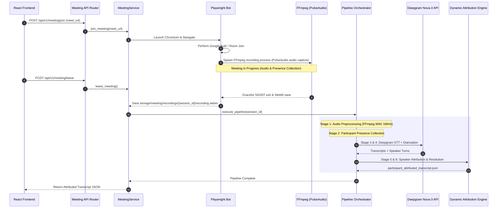

# 05 — Meeting Pipeline Architecture

## 1. Executive Summary & Flow Overview

The KAIO Meeting Pipeline automatically processes live video meetings into speaker-attributed transcripts ready for downstream AI action extraction.

```
┌─────────────────┐       ┌─────────────────┐       ┌─────────────────┐
│   Google Meet   │  ───► │  Playwright Bot │  ───► │ PulseAudio/FFmpeg│
│ Live Session    │       │ Join Only       │       │ Audio Recording │
└─────────────────┘       └─────────────────┘       └─────────────────┘
                                                              │
                                                              ▼
┌─────────────────┐       ┌─────────────────┐       ┌─────────────────┐
│  Attributed     │  ◄─── │ Speaker         │  ◄─── │ Deepgram        │
│  Transcript     │       │ Attribution     │       │ STT + Diarize   │
└─────────────────┘       └─────────────────┘       └─────────────────┘
```

---

## 2. End-to-End Pipeline Execution Flow



---

## 3. Detailed Stage-by-Stage Breakdown

### Stage 1: Audio Preprocessing (`app/meeting/pipeline/stages/audio.py`)
- Reads raw `recording.webm`.
- Uses `FFmpegService` to validate audio integrity and normalize audio to 16kHz mono WAV (`processed_audio.wav`).

### Stage 2: Participant Presence Collection (`app/meeting/pipeline/stages/presence.py`)
- Fetches real-time presence timeline captured during meeting.
- Builds `ParticipantPresenceTimeline` containing join, leave, and display name change events.

### Stage 3 & 4: Atomic Speech & Diarization (`app/meeting/pipeline/stages/speech.py`)
- Dispatches `processed_audio.wav` to `DeepgramSpeechProvider`.
- Invokes Deepgram Nova-3 API with `diarize=true`, `punctuate=true`, `smart_format=true`.
- Output: Atomic transcript text along with `SpeakerTurn` array (start time, end time, speaker integer label).

### Stage 5: Speaker Alignment (`app/meeting/pipeline/stages/alignment.py`)
- Aligns diarized speaker turns with normalized text boundaries to produce `SpeakerAttributedTranscript`.

### Stage 6: Identity Resolution (`app/meeting/pipeline/stages/resolution.py`)
- Invokes `DynamicAttributionEngine`.
- Evaluates overlap between Deepgram speaker turns and `ParticipantPresenceTimeline`.
- Assigns actual participant IDs and display names to speaker turns with confidence scores.
- Emits final canonical output: `participant_attributed_transcript.json`.

### Stage 7: Task Extraction & Proposal Generation (`app/meeting/pipeline/stages/extraction.py`)
- Invokes `LLMTaskExtractor` to extract candidate tasks, priorities, due dates, and action items from `participant_attributed_transcript.json`.
- Resolves speaker labels to participant IDs using `participant_roster.json`.
- Persists draft proposals to database via `fn_create_task_proposal`.
- Emits `task_proposals_manifest.json`.
- Updates meeting session status to `PROPOSALS_READY`.
- Dispatches in-app notifications via `NotificationService` to all **Manager** and **Superadmin** users in the organization.

### Pipeline Failure Handling & Rerun Execution
If any stage in the pipeline raises an unhandled exception (e.g. transient network timeouts during Deepgram STT or LLM extraction errors):
1. **Failure Status Update**: The orchestrator catches the exception, logs error details, and executes `fn_fail_meeting_session(session_id)` to set status to `FAILED` and record `failed_at = NOW()`.
2. **Dashboard UI Alert**: The `RecentMeetingsWidget` displays a red **FAILED** badge along with an error summary tooltip.
3. **Session Rerun Trigger**: Superadmins or Managers can click the **Rerun Pipeline** button on the UI, which calls `POST /api/v1/meeting/{session_id}/rerun`.
4. **Status Reset**: The rerun endpoint invokes `fn_reset_meeting_session_status(session_id)`, clearing `failed_at` and setting status back to `PROCESSING`.
5. **Background Pipeline Execution**: `MeetingPipelineOrchestrator` re-executes all post-processing stages cleanly using existing recorded audio artifacts without re-launching the Playwright bot.

---

## 4. Pipeline Artifact Manifest

Every meeting execution creates a session folder under `backend/storage/meeting/processed_audio/{session_id}/`:

| Artifact File | Schema Class | Purpose |
|---|---|---|
| `recording.webm` | `MeetingRecording` | Raw captured audio file from browser tab |
| `processed_audio.json` | `ProcessedAudio` | Normalized 16kHz WAV metadata |
| `participant_presence_timeline.json` | `ParticipantPresenceTimeline` | Chronological log of attendee joins/leaves |
| `speaker_timeline.json` | `SpeakerTimeline` | Raw diarized speaker turns from Deepgram |
| `speaker_attributed_transcript.json` | `SpeakerAttributedTranscript` | Transcript segmented by speaker turns |
| `participant_roster.json` | `ParticipantRoster` | List of verified participants |
| `speaker_mapping.json` | `SpeakerMapping` | Mapping table (Speaker_0 -> "John Doe") |
| `participant_attributed_transcript.json` | `ParticipantAttributedTranscript` | **Final Output**: Attributed transcript |
| `task_proposals_manifest.json` | `Dict` | Execution record of AI-extracted task proposals |
| `pipeline_manifest.json` | `Dict` | Execution record of completed pipeline stages |
| `pipeline_report.json` | `Dict` | Execution timings, metrics, and summary |

---

## 5. Linux VPS Audio Infrastructure & Headless Pipeline

For headless Linux VPS deployments, physical sound cards and displays are absent. The meeting bot utilizes virtual audio loopback and frame buffer servers:

1. **Headless Display (`Xvfb`)**: Spawns virtual X11 frame buffer on display `:99` for Playwright Chromium navigation.
2. **Virtual Audio Sink (`PulseAudio/PipeWire`)**: Loads virtual `kaio_sink` null-sink module (`pactl load-module module-null-sink sink_name=kaio_sink`).
3. **Audio Playback Routing**: Sets `kaio_sink` as default output sink so Chromium routes tab playback into the virtual sink.
4. **Audio Capture Routing**: FFmpeg spawns with `-f pulse -i kaio_sink.monitor` to stream audio directly into WebM format.

> For complete installation scripts, systemd service units, and health checks, see [14 — Linux VPS Meeting Bot Deployment Guide](./14_VPS_MEETING_BOT_DEPLOYMENT.md).

