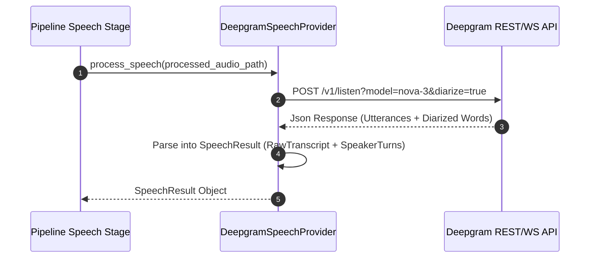
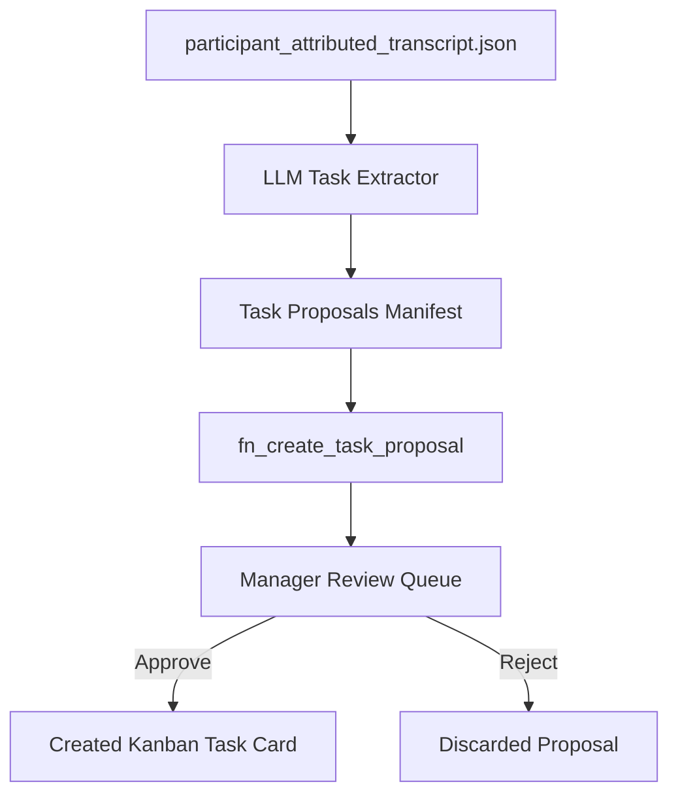

# 06 — AI Architecture

## 1. Executive Summary & AI Strategy

KAIO incorporates AI models across two core operational tiers:

1. **Speech Intelligence Tier**: Cloud-based atomic Speech-to-Text (STT) and speaker diarization via Deepgram Nova-3 API.
2. **Task & Insight Extraction Tier**: Large Language Model (LLM) providers (OpenRouter, OpenAI, Puter API, Gemini 1.5/2.0) that extract task proposals, action items, and key decisions from attributed transcripts.
3. **KAI Board Assistant**: Interactive AI agent (`app/ai/agents/`) exposing chat and tool-calling capabilities for board/task operations via `POST /api/v1/ai/chat`.

```
┌─────────────────────────────────────────────────────────────┐
│                    KAIO AI Integration                      │
├──────────────────────────────┬──────────────────────────────┤
│  Deepgram Nova-3 API         │  Puter / Gemini LLM          │
│  (STT + Speaker Diarization) │  (Task Extraction Engine)    │
└──────────────────────────────┴──────────────────────────────┘
```

---

## 2. Speech Intelligence Tier (Deepgram Nova-3)

### Provider Implementation (`app/meeting/providers/speech/deepgram_provider.py`)

- **Engine**: Deepgram Nova-3 cloud model.
- **Parameters**: `model="nova-3"`, `diarize=True`, `smart_format=True`, `utterances=True`.
- **Atomic Diarization**: Receives speech text and speaker turn intervals in a single API call, eliminating latency and boundary drift associated with decoupled diarizers.



---

## 3. LLM Integration Subsystem (`app/ai/`)

### 3.1 Subsystem Layout

- **`agents/`**: Autonomous AI assistant implementations (e.g. KAI board assistant).
- **`providers/`**: LLM gateways (OpenAI, Puter API, Gemini 1.5/2.0 providers).
- **`gateway/`**: `AIGateway` — routes requests, handles retries, telemetry, and provider switching.
- **`orchestration/`**: `ClarificationRouter` and intent resolution pipelines.
- **`tools/`**: Function calling tools allowing KAI to perform board, task, and meeting operations.
- **`context/`**: Context builders providing workspace and task state to prompts.
- **`prompts/`**: Prompt templates for task extraction, clarification routing, and decision summaries.
- **`telemetry/`**: Performance tracking, token usage, and response latency telemetry.

### 3.2 Provider Interface (`app/ai/provider.py`, `app/ai/providers/`)

The LLM integration is abstracted to allow runtime switching between providers configured via environment variables:

- **OpenRouter Provider**: Default provider. OpenAI-compatible API with access to many free and paid models (`AI_PROVIDER=openrouter`, `OPENROUTER_API_KEY=...`, default model `openai/gpt-oss-20b:free`). Extends `OpenAIProvider` with custom base URL `https://openrouter.ai/api/v1` and `HTTP-Referer` + `X-Title` headers.
- **OpenAI Provider**: Direct OpenAI API gateway (`AI_PROVIDER=openai`, `OPENAI_API_KEY=...`). Base provider that OpenRouter and Puter extend.
- **Puter Provider**: Low-latency OpenAI-compatible LLM gateway via Puter API (`AI_PROVIDER=puter`, `PUTER_API_KEY=...`). Extends OpenAI provider with a custom base URL.
- **Gemini Provider**: Google Gemini API gateway for complex reasoning and large context windows (`AI_PROVIDER=gemini`, `GEMINI_API_KEY=...`).

### 3.3 KAI Board Assistant (`app/ai/agents/`)

- Interactive AI chat agent accessible via `POST /api/v1/ai/chat`.
- Uses function-calling tools (`app/ai/tools/`) to perform board queries, task operations, and meeting lookups.
- Context builders (`app/ai/context/`) inject active workspace and task state into prompts.

### 3.4 KAI Tool RBAC & Risk Reference

Complete reference for all 15 tools. Entries with no `required_roles` are intentionally open — see the in-code `# RBAC:` comment on each class for the rationale.

| Tool | File | `required_roles` | `risk_level` | `is_write_action` | Scope |
|---|---|---|---|---|---|
| `ListBoardsTool` | `workspace_tools.py` | None (all roles) | SAFE | No | Org-scoped via `current_user` |
| `ListTasksTool` | `workspace_tools.py` | None (all roles) | SAFE | No | Org-scoped via `current_user` |
| `GetWorkspaceUsersTool` | `workspace_tools.py` | None (all roles) | SAFE | No | Org-scoped via `current_user` |
| `GetTaskTool` | `workspace_tools.py` | None (all roles) | SAFE | No | Board-access enforced by DB |
| `GetBoardSummaryTool` | `workspace_tools.py` | None (all roles) | SAFE | No | Org-scoped via `current_user` |
| `CreateTaskTool` | `domain_tools.py` | `MANAGER`, `SUPER_ADMIN` | SAFE | Yes | Org-scoped |
| `UpdateTaskTool` | `domain_tools.py` | `MANAGER`, `SUPER_ADMIN` | SAFE | Yes | Org-scoped |
| `DeleteTaskTool` | `domain_tools.py` | `MANAGER`, `SUPER_ADMIN` | **HIGH** | Yes | Org-scoped; confirmation required |
| `CreateBoardTool` | `domain_tools.py` | `MANAGER`, `SUPER_ADMIN` | SAFE | Yes | Org-scoped |
| `ArchiveBoardTool` | `domain_tools.py` | `MANAGER`, `SUPER_ADMIN` | **HIGH** | Yes | Org-scoped; confirmation required |
| `DeleteBoardTool` | `domain_tools.py` | `MANAGER`, `SUPER_ADMIN` | **HIGH** | Yes | Org-scoped; confirmation required |
| `AddCommentTool` | `domain_tools.py` | None (all roles) | SAFE | Yes | Task-access enforced by comment service |
| `GetCommentsTool` | `domain_tools.py` | None (all roles) | SAFE | No | Task-access enforced by comment service |
| `UpdateProfileTool` | `profile_tools.py` | None (all roles) | SAFE | Yes | Self-scoped to `current_user` |
| `GetMyProfileTool` | `profile_tools.py` | None (all roles) | SAFE | No | Self-scoped (no DB query) |
| `UpdateAppearanceTool` | `appearance_tools.py` | None (all roles) | SAFE | Yes | Self-scoped to `current_user["id"]` |
| `GetMyAppearanceTool` | `appearance_tools.py` | None (all roles) | SAFE | No | Self-scoped to `current_user["id"]` |

**Confirmation gate**: `HIGH`-risk tools trigger a `confirmation_required` SSE event. The Executor stores a SHA-256 hash of the pending plan (keyed by `conversation_id`, 5-minute TTL) and validates it when the client resubmits `confirmed_plan`. A tampered or expired plan is rejected with an error before any tool executes.

**`RiskLevel.MEDIUM` (Phase 4 note)**: The enum value and the `if risk in [RiskLevel.MEDIUM, RiskLevel.HIGH]` condition in `executor.py` are structurally present, but **no tool currently sets `MEDIUM`**. This branch is untested. Phase 4 must include a smoke test confirming MEDIUM behaves identically to HIGH for confirmation-gating before any MEDIUM tool is shipped.

**Pre-flight audit**: All `is_write_action = True` tools emit a `preflight_write` record to `logs/ai_tool_audit.jsonl` (interim sink) _before_ `execute()` is called, ensuring mutation intent is logged even on mid-call failures.

---

## 4. Automated Task Extraction & Approval Queue (`app/meeting/pipeline/stages/extraction.py`)

The automated task proposal engine converts completed meeting transcripts into actionable Kanban task proposals:



### Extracted Proposal Schema (`ExtractedTask`):

- `title`: Concise title summarizing the action item.
- `description`: Contextual explanation derived from transcript.
- `suggested_assignee`: Matched participant ID based on speaker attribution.
- `priority`: Suggested priority level (`low`, `medium`, `high`).
- `due_date`: Estimated completion timestamp.
- `confidence_score`: LLM confidence rating (0.0 - 1.0).
- `source_transcript_quote`: Direct timestamped quote supporting task creation.
